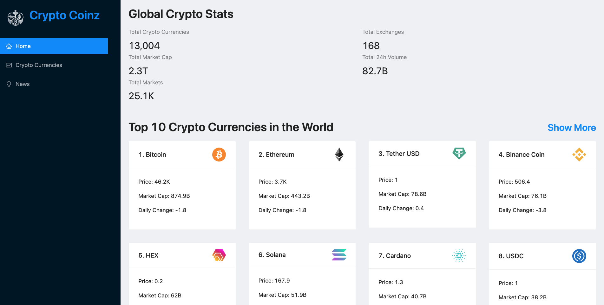

# Crypto Coinz :gem:
## By Adrian Camacho :electric_plug:

---

### Project Description :pencil:

This app is tracker for the top 100 crypto currencies in the world. There is loads of information on the subject matter within the app including live pricing, price history, market caps and the latest news on crypto. View the live site **[here](https://objective-heyrovsky-7f62af.netlify.app/)!**
___
### Tech Stack :floppy_disk:
1. HTML5+CSS3
2. JavaScript/ES2018+
3. React
4. Ant Design
5. Chart.js
6. React-chart-js2
7. Millify
8. [Coinranking-API](https://rapidapi.com/Coinranking/api/coinranking1/)
9. [Bing-News-Search-API](https://rapidapi.com/microsoft-azure-org-microsoft-cognitive-services/api/bing-news-search1?utm_source=youtube.com%2FJavaScriptMastery&utm_medium=DevRel&utm_campaign=DevRel)
10. React-Redux Toolkit
11. Axios
---
### Installation Instructions :pushpin:
1. Clone this repo: `git clone https://github.com/chonnessey/crypto-coinz.git`
2. Enter new directory `cd crypto-coinz`
3. Install dependencies with `npm install`
4. To run it locally, use the npm dev command `npm start`
5. Open your web browser and navigate to http://localhost:3000
6. Click around and explore the crypto space!
---
### Known Bugs: :bug:
No Known Bugs.
---
### Contact Info :inbox_tray:

You can reach me at: <adriancamacho18@gmail.com> :rocket:
___
### License is GPLv3 and I make no claim to copyright. 
 

> You can't steal what is freely given. Enjoy!

 
 
 
 

  <small>Made in Portland, Oregon. </small>

